# Week Four notes
## Excel and R
- I have used Excel before, but the introduction was a nice refresher
- bar graphs in R: 
  - article types 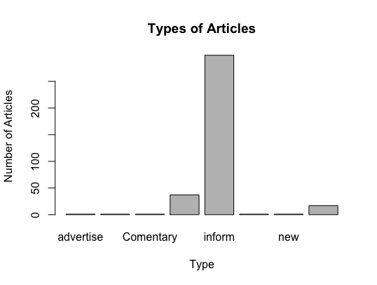
  - newspaper titles 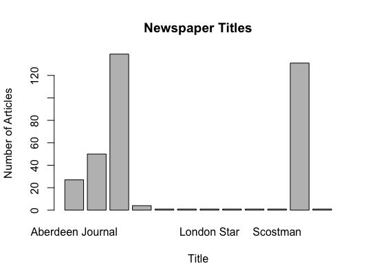
  - publication year 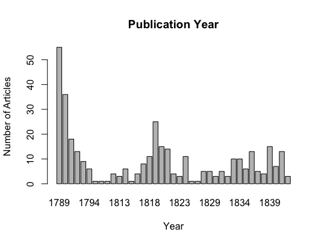
- used [this YouTube video](https://www.youtube.com/watch?v=Cmd8cJCk2lA) but got an error message:
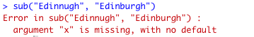
- found [these](https://www.dummies.com/programming/r/how-to-substitute-text-in-r/) [links](https://stackoverflow.com/questions/21187603/replace-characters-from-a-column-of-a-data-frame-r) to change the misspelling in the data
- worked to replace it! used `documents$Newspaper.City <- gsub("Edinbugh", "Edinburgh", documents$Newspaper.City)`
### [other basic visualizations](https://rstudio-pubs-static.s3.amazonaws.com/7953_4e3efd5b9415444ca065b1167862c349.html)
- did the first three visualizations
- scatterplot with tarsus data: 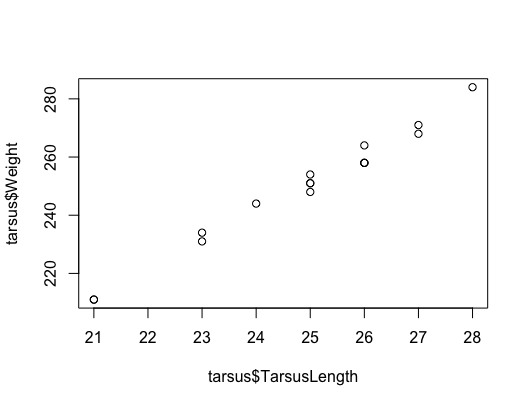
- histogram with unicord data: 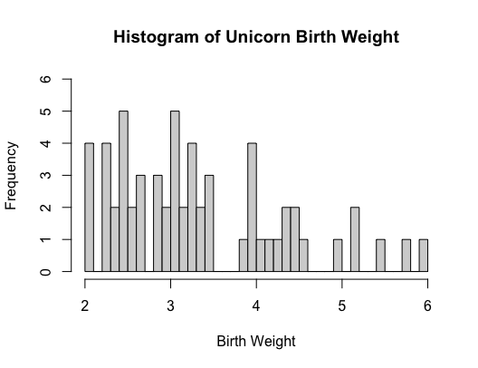
- line graph with regression with moomin data (used [this data](https://ourworldindata.org/world-population-growth#all-charts-preview): 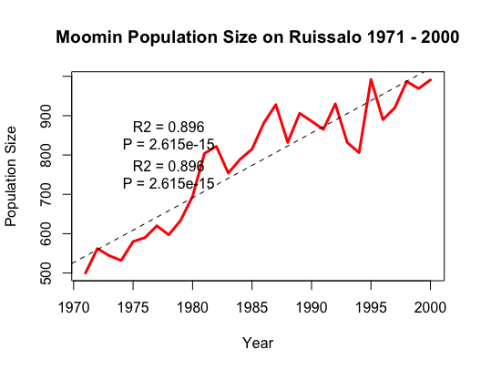

## Voyant
- questions to ask before exploring the data:
  - what is it about?
  - what does it say about something significant? (ie. friendship)
  - what words stand out in the word cloud? what words do you expect to see?
  - how does the langugae change throughout the text? are some words important at the beginning and some at the end?
  - how to correspondences travel? 
  - is there a change over time as the Americas seek autonomy?
- united, kingdom, new, inform, scotland
- clicking a term changes the trends on the right side
- the word "new" increases as time goes on, it is also the most frequent word
- word "mr" is mentioned often, so mostly writing about men
- clicking on multiple terms plots those terms on the graph
- putting `*` at the end of a term searches for variations of the word (ex. America* will yeild results for "America", "Americans", and "Americas")
- used [this video](https://www.youtube.com/watch?v=enjhlnqaXOE) to learn how to embedd html in github
- [posted my embedded visualizatons here](https://paula-rodrigo.github.io/week-four/)
- found it difficult to interpret patters when I don't have a specific idea in mind or argument
- I thought that the dreamscape visualization was interesting because it broadly showed what places newspapers were writing about
  - many reports about Quebec, and America in the Northeast
  - TermBerries visualizaiton shows words that appear near each other and how often they occur (ex. Canada and war)
 - not sure when to stop looking
 ### create your own corpus
- looking for the word "alligator" in the front page of Louisiana newspapers
- API method
- went back to my week two repo to see what the process was like of using APIs--the first time that I went back to use my notes from a previous week
  - now I see why taking notes as I go is important
- when I tried to run the code, I got this error: 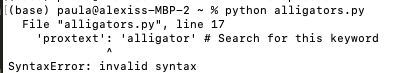
- used [this link](https://realpython.com/invalid-syntax-python/) to find the solution (add commas to separate the lines)
- only got about 20 articles from the API search
- figured out that using this link: https://chroniclingamerica.loc.gov/search/pages/results/list/?date1=1789&rows=648&searchType=basic&sequence=1&state=Louisiana&date2=1963&proxtext=alligator&y=0&x=0&dateFilterType=yearRange&page=1&sort=relevance will show all 648 results
- using this method could be used to get all of the results: 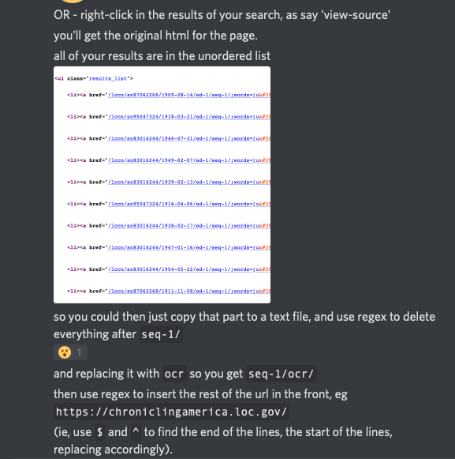
- created the spreadsheet manually with the 20 or so links that I had
  - not sure how this would be done if I had a corpus with all of the results
  - is there a way to open the links and extract the text using code?
- expecting the term to accompany words like "attack" 
  - appeared near words like "baby" and "monster" -- unsurprising and goes with my previous assumptions; also results for alligator hunters
  - surprised to see the term "leather" -- realized that there was a market for alligator leather products, like bags; the "hunters" that related to the term "alligator" could have also been hunting for leather

## AntConc
- corpus constrution: questions of sampling, representiveness, and organization
- I really like the Collocate feature
  - allows for a far reading before looking at the words in context
- I can imagine how the process can take a long time because researchers have to clearn the OCR'd text and then select which files they're going to examine 
- the paterns that come up may take a long time to go through as well
- followed [the tutorial](https://programminghistorian.org/en/lessons/corpus-analysis-with-antconc) instructions
  - searching for "the" 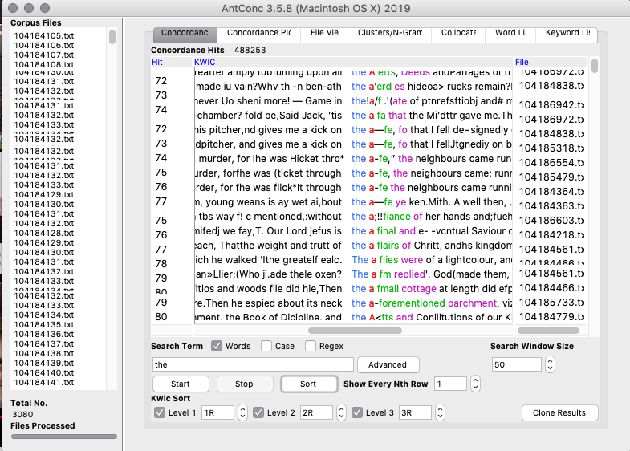
  - searching and sorting "wom?n" 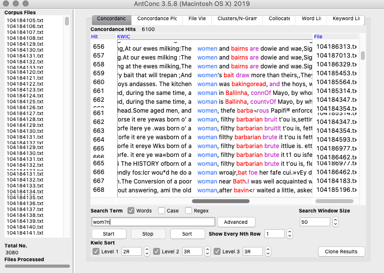
  - searching and sorting "m?n" 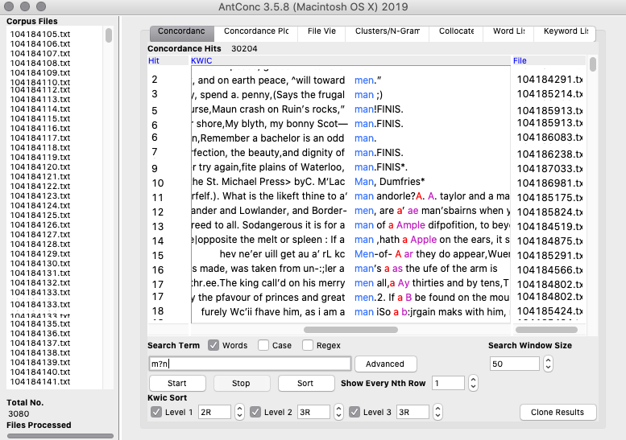
  - searching "she|he" 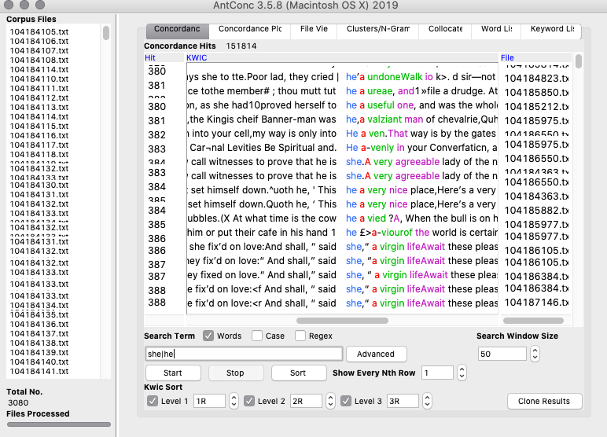
- How people write in chapbooks about women compared to men? 
- What kind of writing do chapbooks produce about women?
- expecting there to be less mention of women than men, expecting the mentions of women to be more superficial than men 
  - for instance, focusing more on women's looks or mentioning them in relation to someone else
- good tool for making comparisons between text (different genres, time periods, topics, etc.)
- next time, I would use this tool on a more specific set of texts so that it is easier to ask questions about the patterns that appear
- word frequency list
- how do you know if your explanation/conclusion is the correct one? must try to find other reasons or compare to a reference corpus or compare to other instances of the word/phrase within the same corpus (for example, look* a little and look a little in https://datasittersclub.github.io/site/dsc4/)
- interesting to see how you can use AntConc with OpenRefine
- things surrounding the word that can change it's meaning
- context around the word--when is it used? who says/writes it?
- using tags
- how do we know when to stop?

## Topic Models
- error intalling: 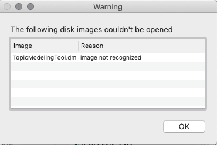
  - Dr. Graham solved the issue by going back into the repository to see if anyone had forked (copied) earlier verisons of the code, where I was able to get a working download link
- choose the number of topics
- decide what to name the topics
- the way the documents are divided up
  - could have divided by date or publisher or writer
### Topic modeling with R
- error message running the code: 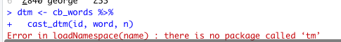
- saw that someone on Discord had the same problem, and the solution was just to install the missing package `install.packages('tm')`. the same solution was posted on [this website](https://github.com/kbroman/RqtlWorkshop/issues/1
) when I looked up the error
- I got a similar error message again later on: 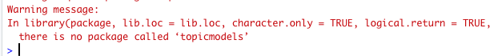
  - used the same solution: `install.packages('topicmodels')` which worked!
- liked using R better because I find code easier to follow along and I can see all of the components going into what is going into creating the model, even if I cannot understand every part of the code

Results:
- 15 topic models 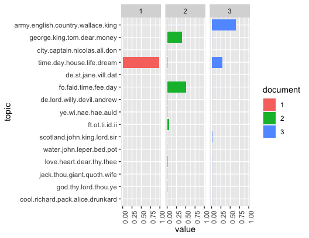
- 15 topic models, topics over time 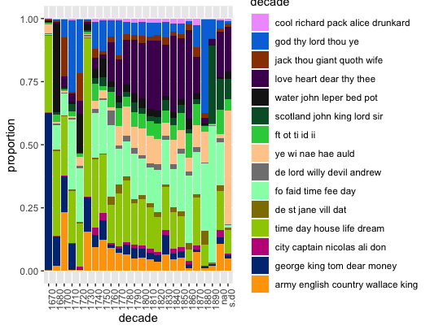
- 5 topic models 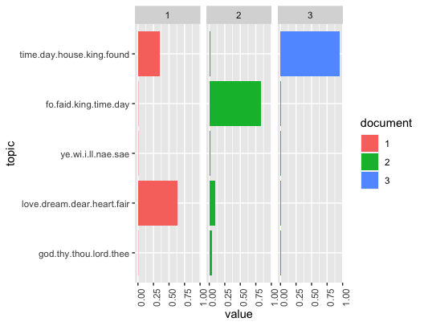
- 5 topic models, topics over time 
- 20 topic models 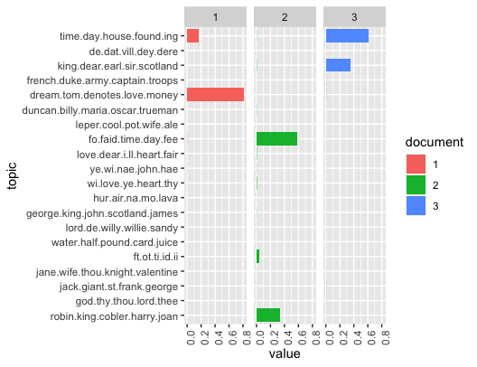
- 20 topic models, topics over time 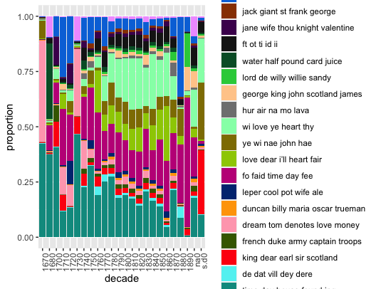
- using less topic models is better for a reading that is more distant; only shows the broader topics that are more common
- using more topic models is good for doing a closer reading of the texts

## bonus activity: Image Analysis
- refreshing to not be working with text
- I think this could be used for other disciplines, not just for digital history (as with a lot of these visualization and modeling techniques)
- I liked the barcodes that showed the dominant and average colours
- could give information about the ink used or the colours that were marketable for that kind of publication (more muted colours, maybe an audience of more mature people or men)
- could compare and contrast these results with other publications that had similar audiences from the time 
- average colour: 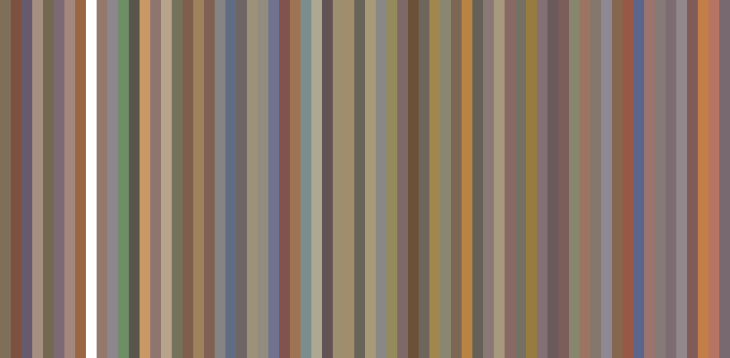
- dominant colour: 
- plotting with brightness on the x-axis and hue on the y-axis shows that most covers use either red or blue: 
